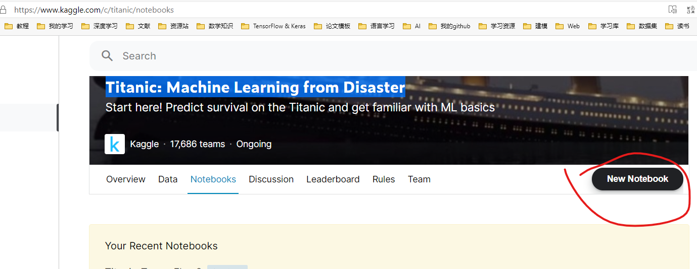
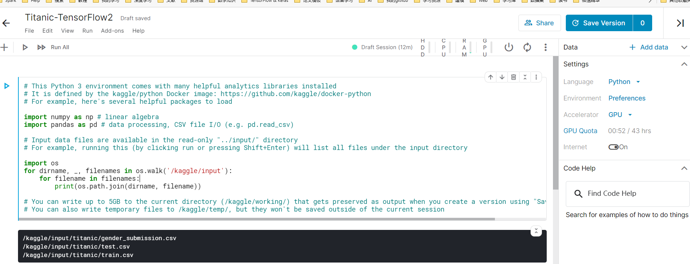
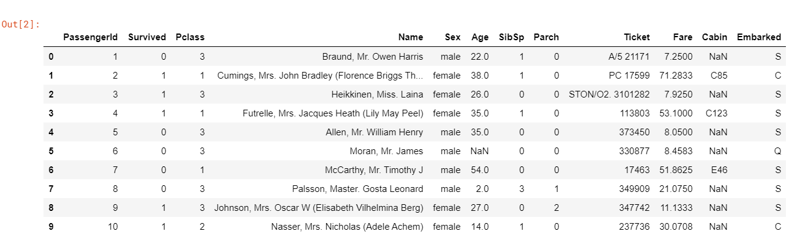
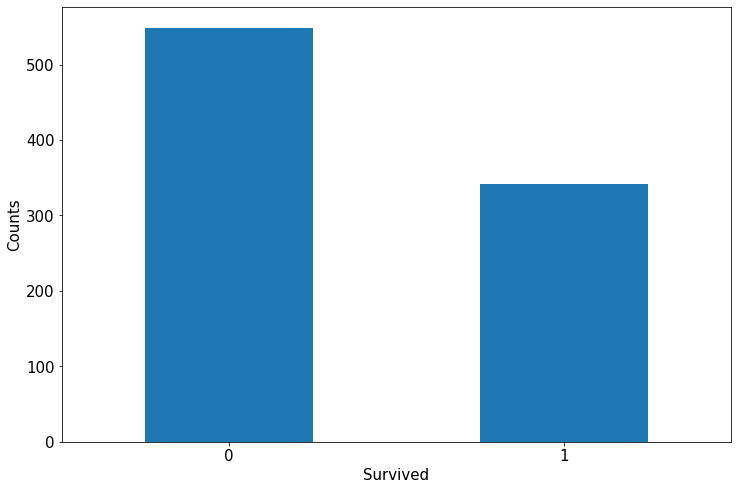
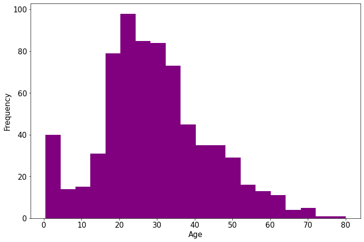
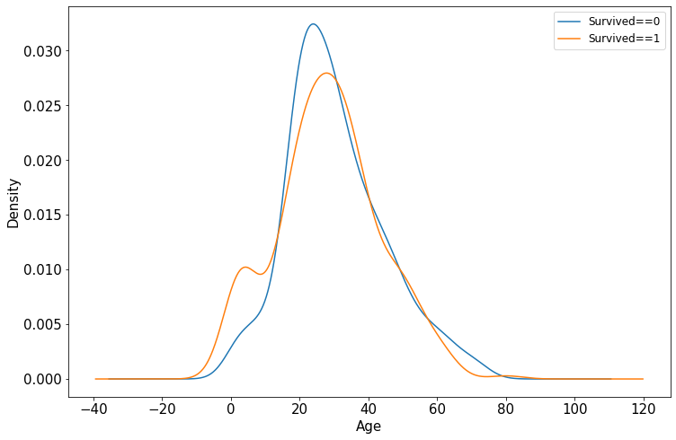

## 在 Kaggle 上学习 TensorFlow

您也许为缺少数据和设备而发愁，Kaggle 您值得拥有！

### 1 结构化数据建模流程范例：Titanic 生存

首先，在 Kaggle 搜索 `Titanic: Machine Learning from Disaster`，并以此创建一个新的 Notebook，修改其名称为 `Titanic-TensorFlow2`：



可以看到已经配置了数据和 GPU：




#### 1.1 准备数据

Titanic 数据集的目标是使用机器学习来创建一个模型，该模型可以预测哪些乘客在泰坦尼克号沉船事故中幸存下来。

结构化数据一般会使用 Pandas 中的 `DataFrame` 进行预处理。

```python
import numpy as np 
import pandas as pd 
import matplotlib.pyplot as plt
import tensorflow as tf 
from tensorflow.keras import models,layers

# 载入数据到 pandas
train_raw = pd.read_csv('/kaggle/input/titanic/train.csv')
test_raw = pd.read_csv('/kaggle/input/titanic/test.csv')
```

显示：



本教程仅仅选择如下属性作为模型的特征：

属性|描述|特征设定
--|--|--
Survived|`0` 代表死亡，`1` 代表存活|作为标签 `y`
Pclass|乘客所持票类，有三种值(1,2,3) |转换成 onehot 编码
Sex|乘客性别|转换成 bool 特征
Age|乘客年龄(有缺失)|数值特征，添加“年龄是否缺失”作为辅助特征
SibSp|乘客兄弟姐妹/配偶的个数(整数值)|数值特征
Parch|乘客父母/孩子的个数(整数值)|数值特征
Fare|乘客所持票的价格(浮点数，0-500不等) |数值特征
Cabin|乘客所在船舱(有缺失) |添加“所在船舱是否缺失”作为辅助特征
Embarked|乘客登船港口:S、C、Q(有缺失)|转换成 onehot 编码，四维度 S,C,Q,nan

利用 Pandas 的数据可视化功能我们可以简单地进行探索性数据分析 EDA（Exploratory Data Analysis）。

1. label 分布情况：

```python
%matplotlib inline
%config InlineBackend.figure_format = 'png'
ax = train_raw['Survived'].value_counts().plot(kind = 'bar',
     figsize = (12,8),fontsize=15,rot = 0)
ax.set_ylabel('Counts',fontsize = 15)
ax.set_xlabel('Survived',fontsize = 15)
plt.show()
```

显示：



2. 年龄分布情况

```python
%matplotlib inline
%config InlineBackend.figure_format = 'png'
ax = train_raw['Age'].plot(kind = 'hist',bins = 20,color= 'purple',
                    figsize = (12,8),fontsize=15)

ax.set_ylabel('Frequency',fontsize = 15)
ax.set_xlabel('Age',fontsize = 15)
plt.show()
```

显示：



3. 年龄和 label 的相关性：

```python
%matplotlib inline
%config InlineBackend.figure_format = 'png'
ax = dftrain_raw.query('Survived == 0')['Age'].plot(kind = 'density',
                      figsize = (12,8),fontsize=15)
dftrain_raw.query('Survived == 1')['Age'].plot(kind = 'density',
                      figsize = (12,8),fontsize=15)
ax.legend(['Survived==0','Survived==1'],fontsize = 12)
ax.set_ylabel('Density',fontsize = 15)
ax.set_xlabel('Age',fontsize = 15)
plt.show()
```



下面为正式的数据预处理

```python
def preprocessing(dfdata):
    dfresult= pd.DataFrame()

    #Pclass
    dfPclass = pd.get_dummies(dfdata['Pclass'])
    dfPclass.columns = ['Pclass_' +str(x) for x in dfPclass.columns ]
    dfresult = pd.concat([dfresult,dfPclass],axis = 1)

    #Sex
    dfSex = pd.get_dummies(dfdata['Sex'])
    dfresult = pd.concat([dfresult,dfSex],axis = 1)

    #Age
    dfresult['Age'] = dfdata['Age'].fillna(0)
    dfresult['Age_null'] = pd.isna(dfdata['Age']).astype('int32')

    #SibSp,Parch,Fare
    dfresult['SibSp'] = dfdata['SibSp']
    dfresult['Parch'] = dfdata['Parch']
    dfresult['Fare'] = dfdata['Fare']

    #Carbin
    dfresult['Cabin_null'] =  pd.isna(dfdata['Cabin']).astype('int32')

    #Embarked
    dfEmbarked = pd.get_dummies(dfdata['Embarked'],dummy_na=True)
    dfEmbarked.columns = ['Embarked_' + str(x) for x in dfEmbarked.columns]
    dfresult = pd.concat([dfresult,dfEmbarked],axis = 1)

    return(dfresult)

x_train = preprocessing(train_raw)
y_train = train_raw['Survived'].values

x_test = preprocessing(test_raw)
#y_test = test_raw['Survived'].values

print("x_train.shape =", x_train.shape )
#print("x_test.shape =", x_test.shape )
```

#### 1.2 定义模型

使用Keras接口有以下3种方式构建模型：使用Sequential按层顺序构建模型，使用函数式API构建任意结构模型，继承Model基类构建自定义模型。

此处选择使用最简单的Sequential，按层顺序模型。

#### 1.3 训练模型

训练模型通常有3种方法，内置 `fit` 方法，内置 `train_on_batch` 方法，以及自定义训练循环。此处我们选择最常用也最简单的内置 `fit` 方法。